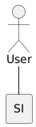
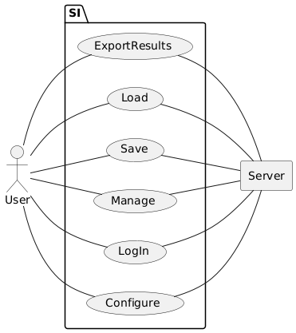
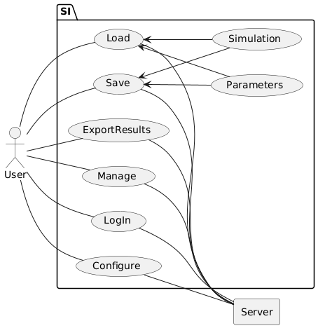
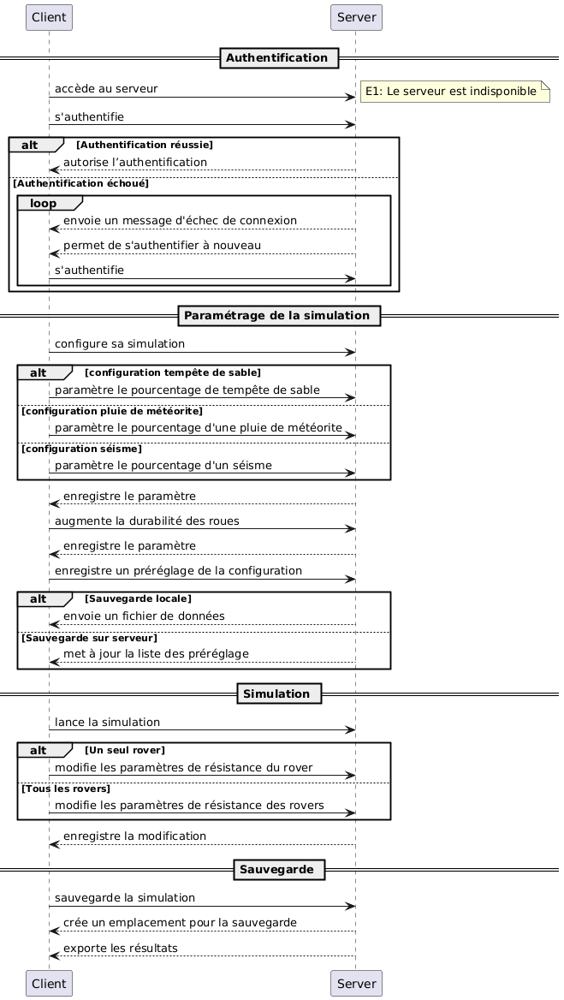

# Rapport de Projet Rover  
*by ...*  

## Table des matières  
- [Introduction](#introduction)  
- [1. Axe Fonctionnel](#1-axe-fonctionnel)  
  - [a. Exigences](#a-exigences)  
  - [b. Acteurs](#b-acteurs)  
  - [c. Diagramme UML](#c-diagramme-uml)  
  - [d. Scénario Nominal](#d-scénario-nominal)  
  - [e. Diagramme de Séquence](#e-diagramme-de-séquence)  
- [2. Axe Statique](#2-axe-statique)  
- [3. Axe Dynamique](#3-axe-dynamique)  
- [Conclusion](#conclusion)  
- [Annexes](#annexes)  

---

## Introduction  
Ce rapport présente notre projet de simulation de rovers. Nous détaillons la conception et le développement en trois axes principaux : **statique**, **fonctionnel**, et **dynamique**.  

L'objectif du projet est de simuler l'exploration autonome de rovers sur un terrain extraterrestre. Les rovers doivent être capables de collaborer, de s’adapter aux contraintes du terrain et de gérer diverses ressources.  

---

## 1. Axe Fonctionnel  

### a. Exigences  
Afin de définir le cadre du projet, nous avons établi une liste des exigences essentielles.  

#### **Exigences des Rovers**  
- Doit être connecté entre eux
- Doit pouvoir gérer la perte d'un membre de manière automatique
- Doit pouvoir gérer sa trajectoire selon la topographie
- Doit pouvoir gérer le carburant/l'Usure
- Doit pouvoir gérer la positions des échantillons
- Doit pouvoir gérer un réseau de Rover

#### **Exigences de la Simulation**  
- Doit pouvoir sélectionner le Spawn des Rovers
- Doit pouvoir gérer la taille de la carte- Doit pouvoir sélectionner le Spawn des Rovers
- Doit pouvoir gérer la taille de la carte
- Doit pouvoir Simuler une météo basique
- Doit pouvoir gérer une carte souterraine(à définir)
- Doit pouvoir gérer la Durée de la Simulation et l'objectif
- L'utilisateur Doit pouvoir gérer des paramètres poussés de la simulation
- Doit pouvoir enregistrer un setup de pramaètres (preset)
- Doit pouvoir exporter les résultats de la simulation (fichier txt)
- Doit pouvoir sauvegarder et charger une simulation encore en cours

---

### b. Acteurs  
Nous avons identifié les principaux acteurs intervenant dans la simulation :  
  

---

### c. Diagramme UML  
Nous avons réalisé un premier diagramme UML (LL1) pour représenter l’utilisateur principal du système :  
  

Ce premier diagramme nous a permis d'affiner notre modèle et de proposer une version améliorée (LL2) :  
  

---

### d. Scénario Nominal  
Nous avons défini un **scénario nominal** pour illustrer le processus standard d'utilisation du système.  

#### **Scénario nominal : Lancer une simulation**  
1. Le client accède au serveur
2. Le client s'authentifie sur le serveur 
3. Le client configure sa simulation (choisit le temps, la météo, etc)
4. La simulation se lance
5. Durant la simulation le Client peut modifier les paramètres de celle-ci
6. Le client sauvegarde la simulation
7. Après validation de la sauvegarde par le serveur le client peut exporter les résultats de la simulation en local

#### **Exceptions**  
- **E1 : Serveur indisponible ou inexistant**  
  - Le client ne peut pas accéder au serveur.  
  - Un message d’erreur est affiché expliquant la raison.  

- **E2 : Échec d’authentification**  
  - Le serveur renvoie un message d’échec.  
  - Le client doit saisir correctement ses identifiants.  

---

### e. Diagramme de Séquence  
Le scénario nominal nous a permis de concevoir un **diagramme de séquence** décrivant les interactions entre les différentes entités :  
  

---

## 2. Axe Statique
*(Contenu à venir...)*  

---

## 3. Axe Dynamique  
*(Contenu à venir...)*  

---

## Conclusion  
*(Contenu à venir...)*  

---

## Annexes  
Inclure du code ou des ressources utiles si nécessaire.  
