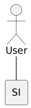
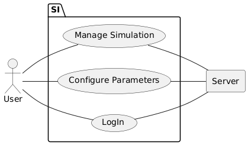
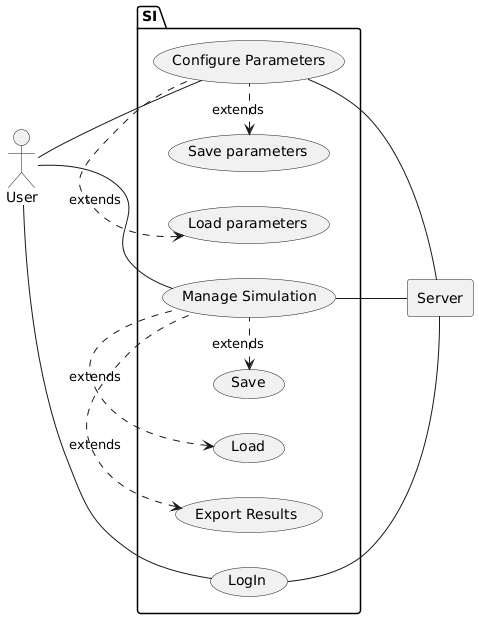
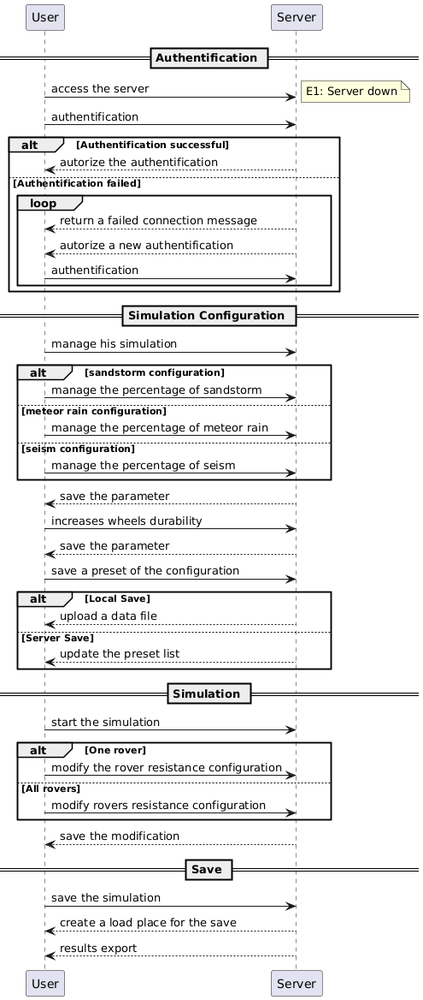
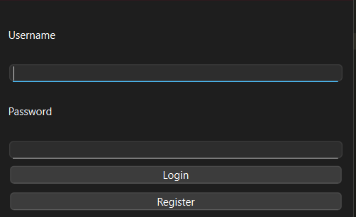
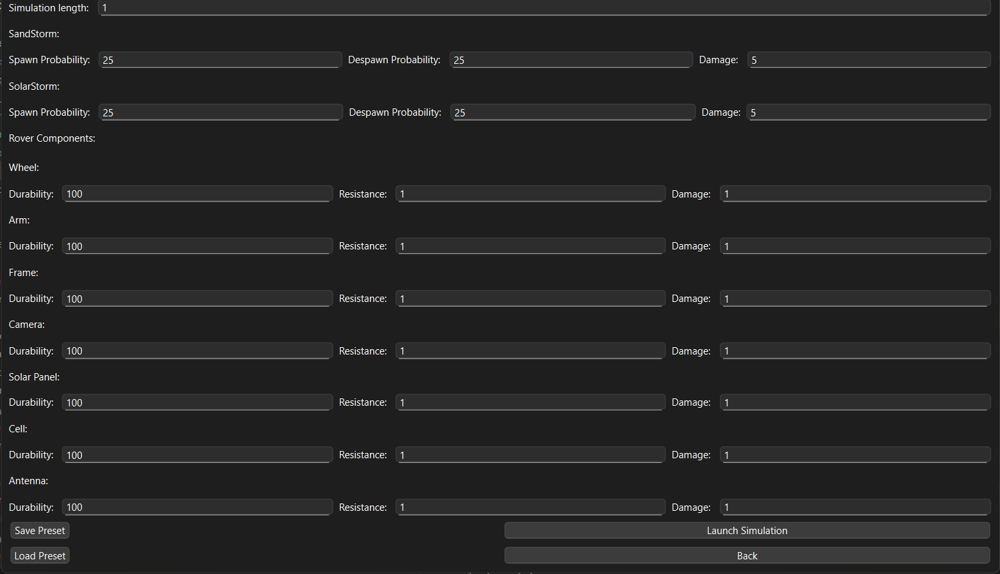
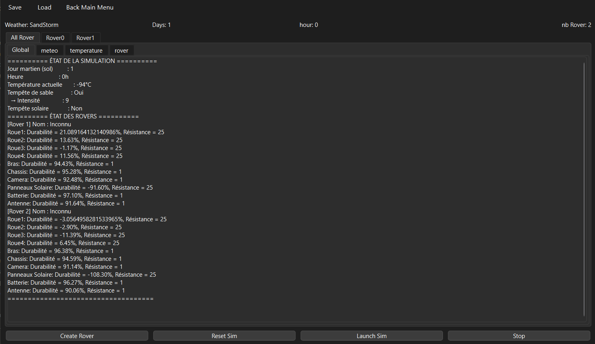

# Rapport de Projet Rover  
*by Dixon Joshua / Chaudet Fearghal / Bourdon Kilian*  

## Table des matières  
- [Introduction](#introduction)  
- [1. Axe Fonctionnel](#1-axe-fonctionnel)  
  - [a. Exigences](#a-exigences)  
  - [b. Acteurs](#b-acteurs)  
  - [c. Diagramme UML](#c-diagramme-uml)  
  - [d. Scénario Nominal](#d-scénario-nominal)  
  - [e. Diagramme de Séquence](#e-diagramme-de-séquence)  
- [2. Axe Statique](#2-axe-statique)  
- [3. Projets](#3-projets)
  - [a. Dépendances et Technologies](#a-dépendances-et-technologies)
  - [b. Utiliser l'application ](#b-utiliser-lapplication )
  - [c. Répartition des tâches](#c-répartition-des-tâches)
  - [d. Amélioration Possible](#d-amélioration-possible)
  - [e. Problèmes rencontrés](#e-problèmes-rencontrés)
- [Conclusion](#conclusion)   

---

## Introduction  
Ce rapport présente notre projet de simulation de rovers. Nous détaillons la conception et le développement en trois axes principaux : **statique**, **fonctionnel**, et **dynamique**.  

L'objectif du projet est de simuler l'exploration autonome de rovers sur un terrain extraterrestre. Les rovers doivent être capables de collaborer, de s’adapter aux contraintes du terrain et de gérer diverses ressources.  

---

## 1. Axe Fonctionnel  

### a. Exigences  
Afin de définir le cadre du projet, nous avons établi une liste des exigences essentielles.  

#### **Exigences des Rovers**  
- Doit être connecté entre eux
- Doit pouvoir gérer la perte d'un membre de manière automatique
- Doit pouvoir gérer sa trajectoire selon la topographie
- Doit pouvoir gérer l'usure
- Doit pouvoir gérer la positions des échantillons
- Doit pouvoir gérer un réseau de Rover

#### **Exigences de la Simulation**  
- Doit pouvoir sélectionner le Spawn des Rovers
- Doit pouvoir gérer la taille de la carte
- Doit pouvoir Simuler une météo basique
- Doit pouvoir gérer la Durée de la Simulation 
- L'utilisateur Doit pouvoir gérer des paramètres poussés de la simulation
- Doit pouvoir enregistrer un setup de pramaètres (preset)
- Doit pouvoir exporter les résultats de la simulation (fichier txt)
- Doit pouvoir sauvegarder et charger une simulation encore en cours

---

### b. Acteurs  
Nous avons identifié les principaux acteurs intervenant dans la simulation :  
  

---

### c. Diagramme UML  
Nous avons réalisé un premier diagramme UML (L1) pour représenter l’utilisateur principal du système :  
  

Ce premier diagramme nous a permis d'affiner notre modèle et de proposer une version améliorée (L2) :  
 

---

### d. Scénario Nominal  
Nous avons défini un **scénario nominal** pour illustrer le processus standard d'utilisation du système.  
#### **Scénario nominal : Lancer une simulation**  
1. Le client accède au serveur
2. Le client s'authentifie sur le serveur
3. Le serveur autorise l'authentification
4. Le client configure sa simulation (choisit le temps, la météo, etc)
5. Le serveur sauvegarde les paramètres
6. Le client augmente la durabilité des roues
7. Le serveur sauvegarde le paramètre
8. Le client veut sauvegarde ses paramètre définis pour plus tard localement
9. Le serveur renvoie un fichier data au client
10. Le client lance la simulation
11. Le client modifie la résistance d'un rover
12. Le serveur sauvegarde la modification
14. Le client sauvegarde la simulation
15. Le serveur crée un nouvel emplacement pour stocker la sauvegarde
16. Après validation de la sauvegarde par le serveur le client peut exporter les résultats de la simulation 

#### **Exceptions**  
- **E1 : Serveur indisponible ou inexistant**  
  - Le client ne peut pas accéder au serveur.  
  - Un message d’erreur est affiché expliquant la raison.  

- **E2 : Échec d’authentification**  
  - Le serveur renvoie un message d’échec.
  - Le serveur autorise un nouvel essai de connexion
  - Le client doit resaisir ses identifiants tant qu'ils sont éronnés

#### **Alternatives**
- **Alt1 : Modification de la résistance sur plusieurs rovers**
  - Le client modifie la résistance de plusieurs rovers
---

### e. Diagramme de Séquence  
Le scénario nominal nous a permis de concevoir un **diagramme de séquence** décrivant les interactions entre les différentes entités :  

  

---

## 2. Axe Statique
L'axe fonctionnel nous a permis de mettre en place les différentes faces du projet qui nous a menés à créer ce **diagramme de classe**:

  
---


## 3. Projets

### a. Dépendances et Technologies

Technologie Utilisé : *python3*, *Markdown*

Dépendances nécessaires: *PyQT6*, *Psycopg2*

### b. Utiliser l'application

Pour lancer le projet partir de la source, faire :

```python3 prog/main.py ```

Une fois dans l'app il vous suffit de créer un compte grâce a cette page: 



Vous pouvez creer votre première Simulation !


Ici vous modifier vos parametres, *Attention* il faut bien appuyer sur **entrée** quand vous validez vos changements :



Après avoir cliqué sur start il vous suffit d'ajouter des Rovers et launch la simulation.



Après avoir attendu 30s (ou plus en fonction du nombres de jours de la sim), vous pouvez retrouvez les graphes globaux ou spécifiques au rovers en alternant entre les tabs. Il est alors possible de sauvegarder votre simulation, d'exit l'app et même retourner au menu principale pour creer une nouvelle simulation avec des paramêtres différents !

---
### c. Répartition des tâches

|   | Kilian  | Fearghal | Joshua |
| :--------------- |:---------------:| :-----:| :-----:|
| Conception | X | X | X |
| Maquettage | | X | X |
| Implémentation | - | - | - |
| Simulation |  | X | X |
| GUI |  | X | |
| Authentification | X |  |  |

---
## d. Amélioration Possible

- Séparation des processus en Serveur/Client avec Autant de Client qui peut se connecter au Serveur

- Compléter Manage Result en permettant d'Exporter les Résultats des Simulations dans un fichier pdf Latex

- Ajout d'un Paramètre Délai et séparer le thread de Calcul de la boucle de Simulation, afin de pouvoir mettre en pause la Simulation une fois lancé

- Poussé les Paramètres de la Simulations

- Gérer la Position des Rovers sur une Carte créer aléatoirement

---

### e. Problèmes rencontrés

- Separation multi-thread 
  
- Difficulte lors de la création du diagramme de classe: première rencontre avec les termes Factory, DAO... 
  
- Retranscription du diagramme de Classe

---

## Conclusion  
Ce projet de simulation de rovers nous a permis de mettre en pratique un ensemble varié de compétences, que ce soit sur le plan technique ou méthodologique. En partant d’un projet clair : simuler l’exploration autonome de rovers. Nous avons donc conçu une architecture logicielle cohérente, construit une interface utilisateur fonctionnelle et mis en œuvre une logique de simulation.

Nous avons rencontré plusieurs défis, notamment la gestion du multithreading, la conception d’un diagramme de classes structuré, et l’intégration des différentes composantes du système.

Il y a toujours des perspectives d’amélioration , que ce soit en termes de performance, de modularité (client-serveur), ou une visualisation 2D de la simulation. Cepandant les fonds pour continuer l'implementation n'était pas suffisants, les developpeurs ont donc du quitter le projet.

Enfin, cette expérience a renforcé notre compréhension du travail en équipe (notamment sur comment utiliser la méthode agile a notre avantage) dans un contexte de développement logiciel
